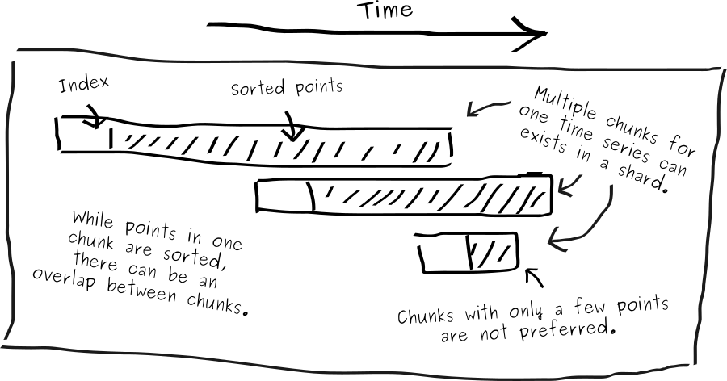

Shards are files for specific time-ranges. On the initial setup of a SiriDB database the shard duration must be chosen.

A single shard has chunks of ordered points, each with an index. This index consists of a time series identifier, a start time, end time and the number of points in the chunk. All points in a chunk belong to the time-range of the specific shard; so chunks between shards can never overlap in time. Within one shard, time series can have multiple chunks which may overlap in time. If this is the case then both the time series and the shard are marked to have an overlap. When selecting data, SiriDB usually just takes the chunks in the right order but when an overlap is detected, SiriDB will also sort the points where required.

Since sorting in general is a slow process which might slow down SiriDB queries, we ideally do not want overlaps. We also do not want a lot of chunks with only a few points since each chunk requires memory and a little disk space. To solve this SiriDB has a thread running for optimizing shards. This task periodically checks for shards which can be optimized. It then takes all chunks for a time series within this shard and re-writes the chunks so that no overlap exists and each chunk has an optimal amount of points.

When SiriDB is started, it needs to rebuild an index for all chunks inside the shards. The indexes are stored in separate files. SiriDB uses an optimization task to do this. Only while optimizing, the index and points are written in separate files. This process stops when new data is written to the shard, no matter if the optimization task is still running or not.

Once optimization is finished, SiriDB can use the index file at startup.
