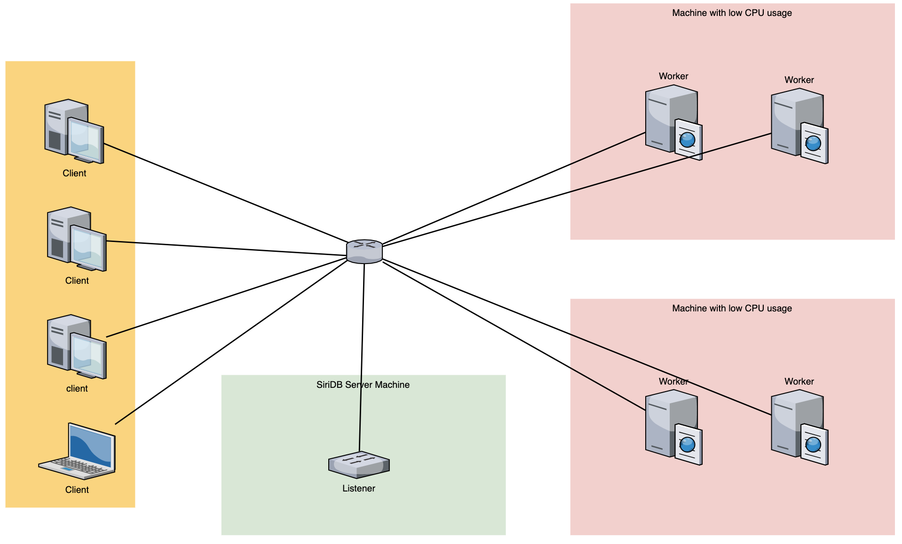

Enodo is a time series data analysis platform made for SiriDB. Combining the power of storing and querying time series data from SiriDB and the analyzing power of Enodo, we can create better understanding of the data that we collect and store. So we can learn from the past and create forecasts for the future.

The Enodo platform is build in modules to create scalability. The Hub will control and organize the data that we have collected and the questions we want to ask about the data. The Worker will perform the analyzing jobs and the Listener will stay on top of the latest data points. Together these components will make sure we can monitor the data in realtime, adjust our expectations for the future and watch for sudden unexpected changes in the data that we collect.

#### Listener

The Enodo listener listens to a pipe socket with SiriDB server. The listener only keeps track of series that are registered via the hub. It sums up the added data points to each of these series and it sends periodically an update to the hub, or when a serie is monitored in realtime, it will notify the Hub immediately. The listener is separated from the Enodo hub, so that it can be placed close to the SiriDB server to gain local access to the pipe socket.

#### Worker

> **Note** : A worker uses significant CPU and thus should be placed on a machine that has low CPU usage.

The Enodo worker executes fitting and forecasting models/algorithms. It can create different models like MA/RA/ARIMA, but also use Prophet, for analyzing series, training models with new data, flagging anomalies and calculate forecasts for a certain series. A worker can implement multiple models. This can be different per worker version. The implemented models should be communicated to the hub during the handshake.

#### Hub

The Enodo hub communicates and guides both the listener and the worker. It tells the listener to which series it needs to pay attention to, and it tells the worker which series should be analysed.
Clients can connect to the hub for receiving updates, and polling for data. Also a client can use the hub to alter the data about which series should be watched.

